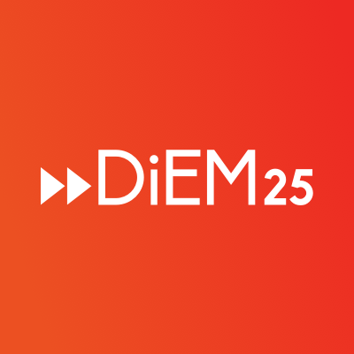

  

# Technological Sovereignty: Democratising Technology and Innovation

## Green Paper No. 1

## 21st August 2018

Authors: Kate McCurdy, Christoph Schneider, David Schwertgen, Joren De Wachter

Based on contributions and a first round of feedback on v1 by DiEM25 members

## Please, give us your feedback:

This is the second draft (v2)  of the Green Paper of DiEM25's pillar "Technological Sovereignty".

After publishing the first draft, we received dozens elements of input, some general, some more detailed. 

Based on that feedback, we now issue a second version of the Green Paper. 

As with the first version, we ask you to provide feedback and comments, so we can use the collective intelligence of the DiEM membership. 

Please help us by following these guidelines for giving feedback:

- Concrete and constructive feedback helps us the most. Please ALWAYS refer to the number(s) of the paragraph(s) that you give feedback on, otherwise your comment may get lost.
- To foster the dialogue within our movement, please use the forum to give your feedback: https://discuss.diem25.org/t/green-paper-no-1-feedback-forum/14821
- If you do not want to use the forum you can also send us an email to techpillar@diem25.org
- Feedback that arrives before 31 December 2018 has the best chance of helping us - but we will look in the forum and the email account after that date. 

The Paper consists of four parts : 
- an introduction, laying out some general points, and introducint the most important policy points
- an executive summary, 
- the main body of the paper, detailing what we believe are the issues, and how to deal with them on a short to long term basis
- the general principles underpinning the DiEM25 approach

## Introduction: For democracy to be possible, technology must be democratized. 

###	0.1 Technology is essential 

1) Our civilisation heavily depends on technology. Technology provides us with the possibility to feed more than 7.5 billion people, to prevent or cure sickness, to multiply social and cultural interaction and creation, to care for those in need, to learn and teach more, to provide safety and security, and to improve the quality of life and increase happiness in many ways for all.

2) But it is only that: a possibility. Not a certainty, and, today, certainly not a reality.

3) DiEM25 is the one political movement that wants to create, shape and drive political debate and democratic process around technology, based on the concept of technological sovereignty.

4) Why? Because, for DiEM25, it is clear that without the introduction of technological sovereignty, through the democratisation of technology, democracy itself is no longer possible. 

5) The examples are manifold. We see monopolistic tech platform providers with tremendous powers to shape what we see, who we hear from, or how we think, without any democratic accountability for that power. We become subject to automated decision-making, wrongly labeled “artificial intelligence”, functioning as a black box, without any transparency or accountability. We are told about killer robots, we breath new pesticides, we anticipate automation of truck driving, cooking and many other professions. All of which may cause massive disruption.

6) But there’s more. We see how the costs of technology’s development and use are socialized, but the benefits are privatized to a very small group. We see how decisions on the choice of which technological development is prioritized are kept away from transparent and public debate. 

7) We see how neo-liberal dogma leads to the financialization of the startup entrepreneurial process, acting as a parasite on the entrepreneurial spirit while trying to convince people of the absurd notion that the purpose of innovation is to make rich investors richer still. 

8) And we are told that we don’t have the power to change anything.

9) DiEM25 disagrees. We are convinced that, while technology is essential, technological sovereignty through democratization of technology is an absolute necessity for democracy to be possible.

10) We know innovation can be beneficial to all. We want to end the practice of socializing the costs and privatizing the profits from technological change. We want to see an entrepreneurial startup ecosystem where all stakeholders are equally important, and society as a whole benefits from the liberated energy of entrepreneurs who are no longer shackled by the financialization of their efforts. We believe in a positive and strong partnership of the public and private sector in creating and sharing knowledge, creativity, research and development, and innovation, to the benefit of the whole of society.

11) And we believe that Europe can become a beacon of hope if it unites political, social and technological progress. If it fosters a new enlightenment and puts the flourishing of all human beings in the centre of technological change. 

###	0.2 The relationship between people and technology

12) Today people are increasingly defined as users or consumers of technology - even as the product itself - rather than citizens. Remember, when the service is free, you’re not the user, you’re the product. 

13) But, as users, consumers or products, people are not empowered. They are not citizens who contribute and have a voice on how technology is shaped, who pays for it, and who benefits from it. They don’t get the real benefits of the knowledge, research and development funded by their tax money. They are effectively powerless against the monopolies of the platform technology giants.

14) DiEM25 wants technology to reflect the values and diversity of the society we aspire. Our different genders, ethnicities, capabilities, values and - most important - our dreams, shall be supported by technology. Technology has to be set up in such a way that it liberates and empowers each of us, to be who we can and want to be, and to fulfill the potential of each of us.

15) That is only possible if we, as sovereign citizens, recapture the ability to make different choices, argue for different values and change the societal processes and powers that shape technologies. We can and must develop technological citizenship in the 21st century, based on principles such as the commons, the ability of self-organisation and the development of counter-power held by citizens.

16) Technology has become a central form of power in society. This power ultimately has to belong to the sovereign citizens of a technologized society. 

###	0.3	Technology in DiEM25’s Progressive Agenda for Europe

17) DiEM25 believes that, in a technologized world, Europe must occupy an important place of humane and responsible technological progress. Not in competition but in cooperation with others. 

18) Europe must use its assets, such as its strong research and innovation landscape, its public traditions, the knowledge of its citizens and its NGOs, its humanistic culture, its diversity and its inventive capabilities. Europe must democratise technologies and innovation, put citizens before companies, sustainability before narrow profit and responsibility before technological feasibility. The alternative is to become overwhelmed by the undemocratic technologies and society models of, among others, Silicon Valley and China.

19) These models favour the few and exploit the many and the living world. They benefit huge corporations who exploit publicly funded technologies, which they aim to optimise, with global reach, for their private profit. In these models the values of a minority shape the technological futures for the vast majority. They are models with contempt for democracy. 

20) DiEM25’s Progressive Agenda for Europe demands a break with this model, and lays a claim to technological sovereignty. Our European Green New Deal demands green innovation and a common share in the benefits of technological progress. Our European constitutional process will create a new digital public sphere. Transparent government requires transparent technologies. A dignified future for labour demands responsible technologies and a collective share in the benefits of automation. An open society that welcomes refugees and migrants needs to welcome technologies that can take part in human development. An ecological transition has to stop and prevent harmful technologies and foster sustainable alternatives. Culture should be freely accessible, while cultural creation should be respected and rewarded.

21) Last but not least there is also a strong strategic case for Technological Sovereignty. It has recently been argued by avant-garde theorists like Nick Srnicek or Slavoj Žižek that no political movement will succeed without a strategy on how to deal with the changes that digitalisation has brought upon state, society and labour. The objective is to bring progressive movements up to speed to debates that already have been held in corporate think tanks for decades. According to Srnicek and Žižek „neither massive grass-roots protests nor well-organized political movements are enough. We also need a narrow striking force of dedicated “engineers” (…) Its task will be to “take over” the digital grid, to rip it off the hands of corporations and state agencies which now de facto control it.

###	0.4	Three important ways to achieve Technological Sovereignty

22) Within DiEM25, by crowdsourcing our collective wisdom, we have identified at least the following three key ways to achieve Technological Sovereignty. Each of the three ways uses two techniques: Regulation and Renewal. Regulation means that, as a society, we take a collective responsibility to shape how technological actors should act or not act. Renewal means that we need to innovate in the way technology and society interact.

23) The first way is the establishment, in Europe, of a Digital Commonwealth. This includes 
- the strenghtening of regulations on Data Protection (GDPR) and ePrivacy to limit involuntary data extraction,
- introducing the concept of mandatory Platform Interoperability, portability of data, Personal Data Storage and Data Commons
- ensuring stronger EU antitrust laws and better enforcement

24) Second, Europe must democratize innovation, and ensure that knowledge is shared in such a way as to benefit as many as possible.

… (two highlights)

Third, Europe must update its democracy and democratic processes by building new ways of public debate and decision making, based on the capabilities offered by new technologies.

… (two highlights).

The democratisation of technology is possible, and necessary. Technologies are never inevitable. They are always based on choices, values and societal processes and powers. We can make different choices, argue for different values and change the societal processes and powers that shape technologies. Technologies that, in return, shape society, and us.

EXECUTIVE SUMMARY 

## Chapter 1 : Data as part of the Digital Commonwealth in the 21st century

###	1.1 What are the issues?

#) Digital technologies are at the heart of the ongoing technological transformation our societies are living through. Since the spread of Internet technologies from the 1990ies onwards, our lives have been enriched with a growing amount of digital technologies and devices, our ways of communication have been changing and our modes of coordination have been subject to vast transformations. 

#) The digital transformation entails many positive aspects and opportunities to improve people’s lives. Our access to knowledge is growing, it is easier to communicate and connect with others, novel creative spaces have opened up. The digital economy has created many new products and services and connected the world more strongly. However, this transformation also has ambivalent and negative effects. The communication revolution creates overwhelming complexity, the spread of misinformation and collective nervousness. The digital economy is automating jobs and consolidating monopolistic structures. 

#) Many of these negative aspects, however, depend less on digital technologies as such, but rather more on the ways in which they are used and governed, i.e. the societal structures and contexts of these technologies. Neoliberal capitalism has created the surveillance capitalism and its platform monopolists that form technological empires with illegitimate power over the lives of billions of people. 
The underlying economic structures, worldviews and cultures – which have gone global – use their user’s attention as the product to be sold to the highest bidders. The resulting data that is extracted and privatised is used to constantly improve the technologies of manipulation to change individual and collective behaviour. These systems sell our freedom to destroy it. For Silicon Valley people are not citizens with rights, virtue and dignity but consumers to be manipulated by marketing and data points to be tracked and sold as commodities. Vast digital infrastructures and datasets have been built and privatised in the hands of a tiny and largely unaccountable economic elite. These very datasets are then used to shape and train automated systems that are being offered back to us „as-a-service“. Work that formerly has been executed by both experts and low-skilled-workers is now done by users and prosumers who create valuable data that is constantly fed back into the system.

#) It is time for a new paradigm of the digital economy. A paradigm through which we establish new forms of ownership and governance of digital technologies, guided by democratic principles. A paradigm that unleashes the power of digital technologies for the common good and that helps to usher in an innovative, democratic, socially just and ecological transformation of our societies and economies. Moving towards such a digital commonwealth in which we will collectively benefit from the digital transformation will help us create a mixed and democratic economy. It will help us gain more democratic rights and to become free and sovereign in our technological choices, as individuals and societies. 

####	1.1.1 From Platform Monopolies to Platform Co-operatives
	
#) The term Digital Capitalism can’t be taken serious enough. Two-Sided Markets or the so called Platform Economy are disrupting the working environment to an extent that may easily be greater than the vast changes that the industrial revolution brought to society. 
And we’ll have to deal with the changes that automatisation will unleash: Self-driving trucks - to mention an often-cited example - may have the potential to render the work of millions of truck drivers - and employees related to trucking activity - useless. Automated decision systems are already handling service tasks such as basic medical advices, online help desks and automated journalism. 

#) The value of data is increasing. In 2016 the European Commission estimated that by 2020 the value of European citizens' personal data will reach €1 trillion in the European market alone. This represents 8 per cent of the total union GDP. Data can be turned into any number of artificial-intelligence/automated decision (AI/AD) or cognitive services, some of which will generate new sources of revenue. Data contributes to the excessive market dominance of a handful of companies. The use of personal data as a commodity has amplified in scale and complexity, leaving regulators struggling to catch up.

#) Dealing with these phenomena requires progressive economic policies (taxation, anti-trust measures, universal citizens dividend) as well as an elaborate analysis on how big data is exploited as a raw material to facilitate these changes.

####	1.1.2 The predominance of platform monopolies

#) The market dominance of a handful of platform cooperations relies on two core principles - the network effect and the lock-in effect. 
The network effect is quite simple: the more people use a certain platform the more valuable it becomes for everyone. The lock-in effect is also well known to people using e.g. social network platforms: the more you integrate the service in your daily life the more dependent you become on the service.

#) One of the key concepts to achieve this huge market dominance is the extraction of big data from the growing user base. The data is being analysed, processed, re-packaged and sold. It is being used to train algorithms and to create a huge information asymmetry that reinforces the effects mentioned above. With every click and every interaction users are adding more raw material into the mix. Every person who uses digital services is creating a valuable economic and social resource in the form of personal data.
Network and Lock-In effects and their prescursors need to be moderated to enable a more and fair competition.

###	1.2 Proposed solutions

####	1.2.1 Short-Term Measures : Strengthen Data Protection and ePrivacy Regulation

#) The basic step to tackle the predominace of platform monopolists is to regulate the use of involuntary extracted data, the strengthening of user rights and the creation and empowerment of Data Protection Authorities to enforce these rights. The General Data Purpose Regulation (GDPR) and the upcoming ePrivacy Regulation are steps into the right direction but certainly not enough.
The e-Privacy Regulation is supposed to protect confidentiality of communications and personal data (such as location data, browsing data, device usage patterns, mobile app use, search queries etc.) in the electronic communication sector by complementing matters covered in a general way by the General Data Protection Regulation (GDPR). The e-Privacy Regulation is meant to be the main framework to protect online communication and is currently being "watered down" by the European Council. The current text will need thorough work to ensure that the privacy, data protection and other fundamental rights in the EU are fully respected.

#) In practice it is of utmost importance to maintain and strengthen the following data protection / regulation measures:

#) 	- Higher level of Privacy Protection By Design and By Default instead of „Privacy By Option“. This explicitly includes the obligation for hardware and software providers to implement default settings that protect end users’ devices against any unauthorised access to or storage of information on their devices. (See forthcoming Specs Paper for Details)

#) 	- Strong requirements for user consent. The request for user consent should be as user-friendly as possible and only for permissions that are crucial to perform the main task(s) of a software/app/smart device. Instead of being asked for general consent upon installation the user shall be asked to Opt-In for every task that the software/app/smart device wishes to perform on their device. Forced consent mechanisms and „All-Or-Nothing“-Consent (like e.g. Cookie Walls) shall be prohibited.

#) 	- No „legitimate interest“ exception to use communication data (email, voice mail, chat, videoconference, VoIP) without explicit user consent.

#) 	- Protect users against third party tracking.

#) 	- All Types of Location Data should be given a high level of protection as they carry a high privacy risk. Technical solutions based on local computation in the end-user’s device should always be preferred over centralised tracking.

#) 	- Metadata processed for security and Quality of Service (QoS) purposes shall be anonymised as soon as possible and the storage of metadata shall be limited to what is strictly necessary for the purpose. 

#) 	- Introduce a provision for collective redress / class action to enforce data subjects rights.

#) 	- Data Protection Authorities will be in charge of monitoring the application of the proposed regulations.

#) The designated goal here is to create an environment in which potential costs of non-compliance with EU regulations start to outweigh the monetisation value of the involuntary extracted data itself. In such an environment companies would focus more on how they can use people’s data only when required, rather than hoarding and monopolising it in the hope of future use.

###	1.2.2 Mid-term Measures: 

#) Enforce Platform Interoperability

#) A huge amount of data is extracted on social media platforms that exploit the lock-in effect to obtain an „all-or-nothing“-consent from their users. To re-open the monopolised social network ecosystem for competition we demand to legally enforceable cross-platform-interoperability for communication across different platforms. The task here is to level the playing field for competition. As long at is more efficient to make user surrender their data and give them very limited control over it, the strong market concentration will always led to a handful of digital platforms being able to gather, aggregate and analyse large amount of data.
Mandatory Cross-Platform-Interoperability can be e.g. achieved by standard basic services with end-to-end-encryption where different services may attach to. (See forthcoming Specs Paper for a list of minimum requirements for interoperability)

#) We largely embrace the concept of „social media as a public utility“. This includes a large public funding for the development of open and decentralised alternatives that embrace
- Interoperability
- Data Portability as described in Article 20 of the GDPR (the right to convert and transfer user data/media to a secure location or to import it to another service)
- Mandatory anonymised, authenticated and end-to-end encrypted digital communication 
- privacy-preserving identity authentication tools
Again: Cross-platform-interoperability needs to be a legal requirement to enable fair competition.

#) Enforcement of Regulation. 

#) To ensure a strong and effective enforcement of data protection, privacy regulation and consumer protection we demand more personnel for National Data Protection Authorities and the creation of a European Data Protection Authority.

#) Stronger Antitrust/Cartel Laws

#) To enable fair competition in the realm of Platform Capitalism and the Digital Single Market we need stronger EU Competition Laws. Regulative bodies like antitrust divisions and cartel authorities shall ask for strong data protection compliance upon corporate mergers. Also they are in need of additional criteria to evaluate the abuse/violation of market power such as 
- network effects and lock-in effects
- access to data relevant for competition
An effective valuation of market power has to keep the whole economic ecosystem in check. 

#) Key regulative measures of these agencies would be to 
- Uncouple corporations that are too large
- Share (anonymised) datasets of big player with public entities - to create public/municipal data commons.
- Collect fines to fund/facilitate alternative developments
- Collect fines to strengthen Data Protection Authorities
- Use fines to fuel a Universal Basic Dividend 

#) (Digital) Taxation 

#) To further limit the negative impact of platform corporations and automatisation it is necessary to close the tax gap. We have to fight the tax evasion of platform companies and create a digital tax on the collection/processing of personal data. 

###	1.2.3 Long-Term Measures:

#) Alternative Business Models: Levelling the playing field for platform co-operatives

#) Effective taxation and regulation will pave the way for the development of platform co-operatives - models of economic exchange which have social and ethical objectives. Platform co-operatives offer a feasible model to encourage the sharing of data, embedding co-ownership, transparency and democratic participation over how data is managed and used. Models could include the sharing of accommodation, transport or the exchange of labour and self-generated energy. 

#) A way for platform co-operative to compete with the vast datasets of huge corporations is to participate in publicly available data commons. 

#) Alternative Digital Infrastructure: Towards Personal Data Storages and Data Commons

#) The value of data relies on their aggregation. Data becomes more valuable when they are shared. Data, as a common good, can become more helpful for co-operation and collective use than it would be as a private commodity with very little value when isolated. Data Commons are a way to aggregate citizens data in a safe, anonymised, transparent and democratically controlled way. Data Commons includes a combination of personal data, city open data, public research data and private data (e.g. obtained through enhanced antitrust measures proposed above).

#) The main challenge for data commons is to create a legal & economic framework in which people want to share their data - and its potential economic value - in a controlled way for the common good. This needs to be backed up by technological solutions that enable the enforcement of rules for data sharing and prevent the misuse of data. 

#) The long-term vision here is the concept of shared personal data as a common resource for innovation. Users would host their private data on a Personal Data Storage - a secure location of their choice - and have full control on how to share data and interact with online services.  A Personal Data Storage may be - for instance - a decentralised, anonymous and encrypted peer-to-peer-network that takes user data and splits it up into encrypted chunks, which get processed by hundreds of other computers across the network. (See forthcoming specs paper for different approaches). The crucial task here is that no raw data is being revealed to third parties. 

#) Users could then choose amongst a vast variety of high-level as well as granular data sharing presets (Smart Rules). Smart Rules will enable users to express certain conditions under which their data may or may not be used - e.g. an event/issue related use of data (e.g. Health Condition Data is only revealed in case of emergency) or licensed based sharing of data for public benefits (only the city / a platform co-operative may use anonymised datasets). There are already promising approaches on how to perform safe queries on such a Personal Data Storage without revealing data but rather to perform code in a safe environment and returning the desired information. (see forthcoming specs paper for more information)

#) Public Funding will be key for the development of new technological solutions and appropriate licensing models but regulation shall pave the way for private capital to flow in that direction as well. 

#) Initially such technical options may only be used by a small group of educated people - who care about privacy and a more social digital economy - but once the technology becomes more user-friendly their usage will increase. Regulations - as outlined above - will make personal data hoarding far more expensive than the creation and development of new privacy compliant technology. 

## 2. Democratising algorithms and data

50) The 21st century has seen an accelerating expansion of information technology in more and more domains
of everyday life, with citizens positioned both as sources of the data collected to accumulate privately-held
wealth and enable state and commercial surveillance, and targets of the resulting applications, which can
entail manipulation, exclusion, and other social harms. Unfortunately, this expansion of information
technology has not been accompanied by expanded democratic control, resulting in a massive concentration
of wealth, power, and surveillance capabilities in a few hands, and little accountability or oversight by the
public. This is the state of affairs today that DiEM seeks to change.

### 3.1. We need democratic control over data collection

51) Data collection has always carried a dual risk: inclusion in certain datasets can render citizens in general, and
members of marginalized groups in particular, vulnerable to being targeted for certain harms - but exclusion
from datasets can lead to other harms in turn. As a non-technical example, consider the decision to identify
oneself as a member of an ethnic minority on a government census. Not identifying one's ethnicity can lead to
the risk of exclusion: perhaps if members of one's ethnic group in the relevant district are undercounted,
crucial social services, such as linguistic and cultural support, will not be provided at sufficient levels to meet
the community's needs. On the other hand, including data on one's ethnic identity brings with it the risk of
being targeted by the state or an affiliated malicious actor, on which point history provides many tragic
accounts of the possible consequences.

52) How does information technology change data collection today? Mostly by making it easier than ever to
collect, store, and process data at unprecedented variety and scale, thus amplifying this dual risk in both
directions. To illustrate this variety, here's a partial list of the different kinds of data whose collection is
facilitated by digital technology:

- personal data, e.g. what you might enter into a form (name, age, sex, race, address, nationality, ...)
- biometric data, e.g. what you might use to unlock an iPhone (face, fingerprint, ...)
- personally authored content, e.g. what you might post on Facebook or send to a friend (text, audio, video, ...)
- behavioral data, e.g. how you interact with a device or website (GPS location, sites visited, time spent on news feeds, clicks on ads, grip on steering wheel, ...)
- behavioral biometric data, e.g. device interactions that identify you personally (speed of typing, direction of
mouse movements, ...)
- second-order inferred data, namely predicting a data attribute you did not provide (e.g. age or race) based on
other data about you (e.g. name or location)

53) As digital data collection extends to more and more arenas of life - our online communication and media
consumption, "smart" devices in our homes and workplaces, CCTV cameras on our streets, automotive
computer systems in our cars, and on and on - it becomes increasingly important that we, as citizens, know
who collects what data about us for which purpose, and retain the choice to withhold our data at will; this
transparency is needed to achieve meaningful accountability for information technology, and build public
trust that our data will not be used to exploit us. In cases where this trust cannot be established, we must
regulate data collection, and, if necessary, ban it altogether.

#### 3.1.1. Reining in the data brokers: short-term measures

54) In the near future, the most urgent priority regarding data must be to curtail its undisclosed circulation to
unidentified third parties, with special attention to sensitive personal data collected for public-interest
purposes. The GDPR offers an excellent starting point, and has already demonstrated that bold legislation can
put the tech giants on notice - but we must go further!

55) - **End involuntary data trading**: For all domains in which data are collected, restrict the sale or access of
individual data to third parties unless the individual providing the data expressly consents to grant that
specifically named third party access, separately from granting general platform access (i.e. checking one box
to 'agree to terms and conditions' will not cover third-party sharing), and separately for each named third
party. ([P8](https://github.com/kmccurdy/techdsc/wiki/P8-Tech-Pillar-Suggestions-DSC-Lower-Austria), L26-27; [P9](https://github.com/kmccurdy/techdsc/wiki/P9-Questionnaire-submitted-by-Diego-Naranjo-(DiEM25-Belgium,-NC-member-and-Anna-Mazgal)), L24)

56) - **Restrict state-enabled corporate surveillance of the public**: From Lockheed Martin running data collection
for the 2001 and 2011 UK censuses to American police departments using Amazon's facial recognition software
for real-time database matching, "public-private partnerships" which purport to increase "efficiency" in fact
represent taxpayer money spent to funnel ever more data on nonconsenting citizens to unaccountable
corporations. These practices must be banned. In cases where assistance is required for core state data
processing capacities, such as the census, only partnerships with non-profit organizations should be
considered.

#### 3.1.2. Our data belongs to us: rethinking ownership in data collection

57) In the longer term, our vision must shift from reactive to constructive: how can we build the social
infrastructure and tools to make data collection inclusive, and harness the liberatory power of technology for
the public good?

##### 3.1.2.1. Fund development on open, secure protocols for data ownership:

58) The original foundation of the open web was open protocols, enabling the routing of communication within
and across networks - but platform monopolies have been able to build a proprietary data layer on top of
these protocols, leading to surveillance and lock-in for users. We must actively fund development on protocols
for secure routing and communication which empowers us to truly own our data, and be able to move it
between platforms at will. ([P1](https://github.com/kmccurdy/techdsc/wiki/P1-Suggestion-for-a-European-Progressive-Media-Fund); [P6](https://github.com/kmccurdy/techdsc/wiki/P6-European-Autonomous-Data-Network); [P16](https://github.com/kmccurdy/techdsc/wiki/P16-Public-Digital-Identity); [P4](https://github.com/kmccurdy/techdsc/wiki/P4-Input-DSC-Vienna2), L26; [P13](https://github.com/kmccurdy/techdsc/wiki/P13-Addition-to-proposal-Autonomous-Data-Network); [P17](https://github.com/kmccurdy/techdsc/wiki/P17-Proposal-Input-from-Carlo))

##### 3.1.2.2. Establish a public data commons:

59) Building and maintaining quality data resources, and ensuring their availability for applications in the public interest (e.g. scientific research, good governance analysis, etc.), provides a counterweight to the vast data stores of platform monopolies. Subject to appropriate protections, data produced by public institutions should be be made open and accessible by default; individual citizens and organisations should be able to contribute their data to the commons on a voluntary basis. The commons must ensure that data is nonpersonal or anonymised. Public institutions engaged in the collection of data for the commons must also conduct a thorough stakeholder analysis, with the aim of inclusive data collection along the dimensions of gender, race, class, nationality, sexual orientation, inter alia. Institutions should assess the risks for marginalized populations associated with representation in the dataset (inclusionary harm - risk of being targeted) versus absence from the dataset (exclusionary harm). ([P9](https://github.com/kmccurdy/techdsc/wiki/P9-Questionnaire-submitted-by-Diego-Naranjo-(DiEM25-Belgium,-NC-member-and-Anna-Mazgal)), L28, L122)

##### 3.1.2.3. Redistribute the value our data creates:

60) Platform monopolies have built empires of wealth on our data, but we haven't been invited to share in the
proceeds. This obviously must change, although how that happens is a topic for debate - so please, DiEMers,
give your feedback! Some thoughts:

- "Data as labor": [P12](https://github.com/kmccurdy/techdsc/wiki/P12-Work-force-and-data) suggests the model of treating data producers as workers, and ensuring compensation for the value generated by their data. This proposal resonates in certain aspects with other critiques of the online data economy; see also, for example, Jaron Lanier's "Who Owns the Future?", and the [Wages for Facebook](http://wagesforfacebook.com/) campaign. [P18](https://github.com/kmccurdy/techdsc/wiki/P18-Intellectual-Property-for-Contributors) also raises the possibility of improved recognition of economic value for content providers, under a broader conception of 'content'.
- However, there are some strong counterpoints: [P17](https://github.com/kmccurdy/techdsc/wiki/P17-Proposal-Input-from-Carlo) suggests simply banning proprietary data collection altogether, while [P9](https://github.com/kmccurdy/techdsc/wiki/P9-Questionnaire-submitted-by-Diego-Naranjo-(DiEM25-Belgium,-NC-member-and-Anna-Mazgal)) L28 cautions against "models based on "data ownership" that envision the possibility to to trade personal data for services and benefits. It would affect the vulnerable populations that have less resources and digital literacy and therefore enable forced trade of fundamental rights." - on which point a personal note of agreement from me: as most data collection for advertising and so on is focused on predicting consumption, it's fairly well established in the current data economy that *data from wealthier people is more valuable*, raising the risk that compensation for data could inadvertently end up reinforcing current hierarchies and power structures.

### 3.2. We need democratic control over data-driven applications

61) Independently of data collection, there is also a pressing need for greater oversight in the application of
data-driven information technology; for example, your picture may not appear in the image database used to
train a facial recognition system, but if that system is used on you, its biases and potential harms are of direct
concern to you. Nevertheless, while the scope of a data-driven application may differ drastically from the
context of the original data collection, in practice the two processes are often closely intertwined - especially
in the case of algorithmic technology, where application generally involves continuously collecting new data
to evaluate and refine system performance. In any event, information technology applications based on data
inherit the dual risks described above, and often constitute the point at which these harms are realized.

62) Algorithmic profiling based on given or inferred data attributes can lead to an individual being targeted for
those attributes - indeed, that is often the point. One possible harm resulting from targeting is
discrimination; for example, a [2015 study](http://www1.icsi.berkeley.edu/~mct/pubs/pets15.pdf) found that Google systematically delivered ads for lower-paying jobs
to profiles identified as women job-seekers. Another possible harm receiving increased attention lately is the
possibility an individual might be targeted for purposes of *manipulation* by third parties, ranging from
unscrupulous advertisers (for instance, [online casinos targeting gambling addicts](https://www.theguardian.com/society/2017/aug/31/gambling-industry-third-party-companies-online-casinos)) to [political propagandists](https://www.theguardian.com/news/series/cambridge-analytica-files)
and promulgators of "fake news.")

63)On the other side of this dual risk, algorithmic systems trained on a dataset which excludes, or
underrepresents, a particular population - usually a historically marginalized group - offer another form of
discriminatory harm: reduced system accuracy on that population, or reduced system capacity to serve that
population. Examples of this include Siri [directing women](https://www.salon.com/2016/01/29/siri_find_me_an_abortion_provider_apples_weird_anti_choice_glitch_is_finally_on_its_way_out/) with reproductive health inquiries to misleadingly labeled religious anti-abortion centers, and law enforcement using facial recognition systems which are known
to have a [higher error rate for women and people of color](https://www.theverge.com/2018/5/23/17384632/amazon-rekognition-facial-recognition-racial-bias-audit-data).

64)Data-driven applications are used to inform incredibly consequential outcomes for citizen's lives, from media
consumption to job opportunities to [eligibility for welfare benefits](https://algorithmwatch.org/en/high-risk11citizens/). To ensure they do not reinforce inequality and manipulation, but serve the public interest, we need
transparency and democratic governance over their use.

#### 3.2.1. Algorithmic accountability: Defining our rights

65) ([P20](https://github.com/kmccurdy/techdsc/wiki/P20-Proposal:-Algorithmic-Accountability)) With regard to the use of algorithms in everyday life, we demand that the following rights be
recognized:
66) - Right of interaction: Citizens have the right to know when they are or aren't interacting with an algorithm.
	- When an individual receives an outcome from a service that is based wholly or partially on algorithmic computation, this should be clearly and transparently communicated.
    - AI is not allowed to "conceal" itself in interactions with unknowing citizens, as seen in the initial [Google Duplex tests](https://www.theverge.com/2018/6/27/17508728/google-duplex-assistant-reservations-demo).
    - On the other side, businesses are not allowed to "conceal" human data processing to [users who believe themselves to be interacting with an algorithm](https://www.theguardian.com/technology/2018/jul/06/artificial-intelligence-ai-humans-bots-tech-companies).
67) - Right of equal treatment: Citizens have the right to be free from algorithmic discrimination.
     - If algorithmic services provide outputs of consistently lower value or quality to or about users coming from historically marginalized backgrounds, this constitutes discrimination ([example from google search](http://time.com/5209144/google-search-engine-algorithm-bias-racism/)).
     - Users should be able to compare outputs based on different demographic profiles (e.g. "would this search result be the same if I were to change the gender or age the algorithm has inferred for me?").

#### 3.2.2. Algorithmic emancipation: Building an intelligent, accountable future

68) - **Public audits** ([P20](https://github.com/kmccurdy/techdsc/wiki/P20-Proposal:-Algorithmic-Accountability)): The EU shall develop an independent public institution to conduct algorithmic audits in
a transparent manner, with resources allocated proportional to estimated scope of a) affected citizens and b)
potential harms.

69) - **Opt-out** ([P20](https://github.com/kmccurdy/techdsc/wiki/P20-Proposal:-Algorithmic-Accountability)): An "algorithmic opt-out" rule shall be established: for any algorithmic service, a user can
choose to receive an outcome with a "default" profile (i.e. with the user's personal/demographic attributes
removed from calculation).

70) - **Labor intelligence** ([P15](https://github.com/kmccurdy/techdsc/wiki/P15-Labor-Intelligence---Shared-Worker-Governance---Cooperative-Intelligence)): The EU shall fund a research institute working specifically at the intersection of
Artificial Intelligence and labor with the following mandate:
	- It shall explore and prototype intelligent systems with various axes of worker control (i.e. ranging from 'being designed along worker-friendly principles' to 'responsive to real-time worker input' to 'explicitly includes cooperative decision mechanisms for key decisions').
	- It shall partner with existing organizations, in particular cooperatives (platform and otherwise), to apply and test systems under real-world conditions.
	- It shall assess outcomes with particular attention to humanistic goals, quality of life, and workercentered perspectives, emphasizing the dignity and autonomy of workers.
	- It shall require particular attention to barriers faced by marginalized workers and workers from traditionally excluded backgrounds.

## Chapter 4. Free knowledge for democratic innovation - the role of Intellectual Property and education

### 4.1. What are the issues?

71) Intellectual Property (IP) is a system of government-created and enforced exclusive rights (legally created monopolies) on certain aspects of creativity and innovation. They include e.g. patents, copyright, trademarks, trade secrets, database rights, and other similar rights.

72) There are two standard justifications for IP. Recognition and reward. The reward justification for IP consists of the argument that it protects the creator or innovator, by providing them a monopoly that is limited in time and scope, so they can benefit from the ability to recover their investment. After a time, the monopoly lapses, and the invention or creation becomes part of the public domain - i.e. the classical freedom of enterprise, where everything that is not forbidden is allowed, regains its normal place in the market. The recognition justification consists of the argument that IP recognizes creators and inventors, and their contribution to society.

73) There are a number of problems with IP today.

74) First, there is the continued expansion of the monopoly rights. Copyrights, originally 18 years long, now last
at least until 70 years after the death of the last contributing author (and for Disney a bit longer). Patents
used to be for narrow, technical applications (“downstream” aspects of technology), but now apply ever more to “upstream” aspects of technology methods (i.e. ideas), protocols, discoveries (e.g. in the field of biology), software, and many other aspects that used to be non-patentable. In addition, the standards for "novelty" are sometimes laughable. To give a classic example, in Australia, after a patent law reform, someone managed to obtain a patent on the novel invention of the "wheel". Furthermore, new IP
rights are invented on a continuous basis: examples are database rights, trade secrets, performers rights and
the new secondary copyright for publishers in the draft Copyright Directive.

75) The public domain is under continuous attack from privateers.

76) Second, the link between the creator/innovator and the IP right is no longer functional. The full
transferability of IP rights has the practical effect of allowing hoarding of monopoly rights to the place in the
economic value chain where they produce the least benefit: with marketers and distributors. The actual
creators/innovators typically get little to no benefit from or recognition for their contributions.

77) The consequences are seriously problematic. For example, while public money provides for most R&D in
developing new drugs, we see that the R&D budget of large pharmaceutical companies is a fraction of their
marketing budgets, and most of their R&D budget is spent on research to "me-too" patents: patents on
slightly different versions of drugs that already exist, in order to artificially extent their monopoly position
(and pricing). It is a classical example of socializing the cost and risk of developing new drugs, while privatizing
the benefits. The same is true for other innovations and research at universities and other research centres
funded with public money. Far too often, the results of such publicly funded research is privatized, often in opaque and non-transparent ways,  through the creation and transfer of IP rights to privately held spin-offs.

78) Third, IP rights have a number of negative effects on the economy and society. The rent they extract
generates huge transfers of money to a limited number of corporate monopoly holders and their
shareholders. This leads to a very regressive income distribution and significantly adds to economic inequality.
People who work pay rent to people who hold government-created monopolies on the proceeds of that work
and get rent as unearned income purely as unproductive rights holders.

79) IP rights, today, seem to significantly slow down innovation. They allow large established businesses to use evergrowing monopoly rights to block access to their market to newcomers or competitors. Initiatives like the draft Copyright Directive allow copyright to be used as a way to censor content, [reducing ever more the
freedoms](https://www.opendemocracy.net/can-europe-make-it/renata-avila-joren-de-wachter-christoph-schneider/eu-is-killing-our-democratic-sp) that the Internet was supposed to give us.

80) In the discussion on the draft EU Copyright Directive, the monopoly holders of content (the entertainment
industry) are fighting with the monopoly holders of the tech industry. But who defends the interests of
consumers, citizens and creative people?

81) In addition, in many countries IP monopolies actually benefit from tax exemptions or preferential
treatment, allowing large multinationals to shift their profits, and benefit from tax forum shopping.

### 4.2. What does DiEM propose as fundamental solutions?

#### 4.2.1. Break the cycle of "socializing costs, privatizing benefits"

82) Knowledge, R&D and innovation that are funded by public money should remain "common".

83) In practical terms, this means that content created by public funds, such as scientific research, should be, by
default, available under systems like the most permissive creative commons licenses.

84) Any software code whose development is funded by public money should be made available under Free and
Open Software licenses. (note : DiEM25 does not have any a priori preference for any category of licenses. We are aware that there is a whole ecosystem, and, depending on context and the area, the choice of the appropriate licence will have to be made. We do not believe in a "one size fits all" approach in this context.)

85) This has several benefits: it provides for independence from non-EU based suppliers, it increases the security
and stability of the software and it breaks the de fact monopoly of many technical platform providers.

86) While exceptions can be possible under strict circumstances, any such exceptions must be accompanied by a
practical way for the public investment to share in the proceeds of any monopoly granted. An example could
be that any spin-off created to monetize the result of publicly funded research, has to grant, on incorporation,
20% of its shares as non-voting shares to the authorities that funded the research.

#### 4.2.2. Break the cycle of IP monopolies encroaching on the public good

87) Introduce a fundamental "Right to Repair": the buyer of a product or service has the right to repair any
aspect thereof (or have it repaired for them) and IP rights cannot be used as a means to block such Right to
Repair. The Right to Repair includes the right to alter the technical standard in which something is made or captured. This means that if you buy something in one technical standard, you have the automatic right to convert it into another technical standard.

88) Introduce the principle of Open Standards. Technical standards must be documented so that interoperability
is ensured, and they may not be subject to IP monopolies.

89) Reduce maximalist copyright tendencies: harmonize exceptions to copyright, introduce a "fair use" concept
with broad application, based on freedom of speech. Force collecting societies to provide full transparency on
the rights they claim to represent, the cost they charge, and how much they pay to the right holders.

90) Reverse the burden of proof in copyright: unless something can be shown to be clearly under copyright, it
must be in the public domain.

91) Reform the Berne Convention, and make copyright subject to registration, and payment of a fee that
increases with time.

92) Ban the concept of IP rights on anything invented or created by machines.

93) Open a debate on the patent system: should it be abolished, or should it be reformed so that it can fulfill its
original ambition: reward inventors, and share the knowledge of their inventions throughout society.

94) Declare any information "found in nature" to be in the public domain. Biological information carriers such
as DNA or RNA must be classified as "Open Content" languages, and not subject to any IP right.

#### 4.2.3. Break the cycle of hoarding monopoly rights by distributors and marketers

95) Limit the enforcement of IP rights so that it benefits the actual inventor/creator, not their assignees/licencees when they do not contribute economic value. This will increase the inventor/creator's recognition, and ensure that they actually benefit from the IP monopoly that government creates for them.

96) Abolish any tax incentives to create, transfer or collect IP rights.

97) Create a special tax on the rental income of existing IP rights as a contributory funding for the Universal
Basic Dividend as proposed in the European New Deal.

98) Make it much easier to disable a patent because it does not cover something that is actually novel.

#### 4.2.4. Short term solutions:

99) Reversing the tax treatment of IP is the easiest immediate step to take. This means that any preferential tax
treatment of royalties or other income (rent) deriving from IP, such as lower tax rates or higher exemptions on
such income, must immediately be withdrawn. They should be replaced by the opposite: income from IP (rent)
must be taxed preferably at higher rates, and more progressively, than income from selling actual goods or
services.

100) In addition, the draft EU Copyright Directive must be fundamentally reviewed, in order to obtain much
more balanced rights of users, re-users, creators and innovators. A European "fair use" concept must be
created, with broad applications, and based on the fundamental freedom of speech.

101) With immediate effect, public authorities must switch, where possible, to using open source software.

102) Any patent on software functionality may only be awarded subject to full disclosure of all source code
related thereto.

103) Public funding of open source software can be envisaged.

104) Introduce a general principle that any IP that belongs to a legal entity that goes bankrupt, is liquidated or otherwise ceases to function, is released into the public domain. Equally, any IP ceases to be valid on the death of the inventor/creator.

### 4.3. Education and Technology

#### 4.3.1. What are the issues?

104) Knowledge is power. If we want to democratize technology, and start the debate around how society
determines which technologies are developed, which are supported, how they are regulated and whether
some should be banned, we need to ensure that informed debate is a priori possible.

105) Leaving everything to the experts is not a solution. Their expertise always comes with opinions and values
attached to it, with a view on society and how it should function, in other words with a political view. Even if
they deny it (especially if they deny it), the political views of technical experts should be viewed with normal,
democratic skepticism.

106) Decisions are never without value. But in order to be able to judge the values that are applied in decisions
on technology, it is often necessary to understand, at least to a certain extent, the technology concerned.

107) Democratic debate assumes "Mündigkeit", and this is where education plays a key role.

108) Education, not just of the young. Also of the elderly, who sometimes are lost with all those new
technologies popping up all around them. And of the civil servants who have to devise the administrative
framing of the political discussions around technology. How a problem is presented, often within a certain
bureaucratic system, is often key to the solutions that are deemed "possible".

109) Finally, we know there are serious issues of gender equality and representation in science and technology,
and in the many government, quasi-government and private bodies that take key decisions in this area.

110) So the key issue is: how do we, as a society, promote and ensure the knowledge necessary for a proper
democratic debate around technology?
111) (contributions [P2](https://github.com/kmccurdy/techdsc/wiki/P2-Input-DSC-Vienna1), [P3](https://github.com/kmccurdy/techdsc/wiki/P3-Proposal-for-reform-of-education-media--and-technology-related-subjects-and-topics-in-School,-university-as-well-as-the-public-sector-like-libraries), [P8](https://github.com/kmccurdy/techdsc/wiki/P8-Tech-Pillar-Suggestions-DSC-Lower-Austria))

#### 4.3.2. What does DiEM propose as fundamental solutions?

##### 4.3.2.1. Modify education curricula to include principles of knowledge towards technological sovereignty

112) Education systems and curricula should be updated to ensure that education allows for students to obtain
"Mündigkeit" on technology matters.

113) This means not only teaching about the basic principles underpinning technology as such (a minimum of
STEM for every student), but also explaining the relationship between technology and society, e.g. by pointing
out alternative systems such as the commons and other economic models of technological development and
management.

114) It is clear, in this respect, that our education systems should reflect, and educate, much more on the crucial role of technology in society, and the concept of Technological Sovereignty. Approaches such as MOOCs (Massive Open Online Courses) can play a crucial role in this respect, providing a publicly available repository of knowledge and understanding.

##### 4.3.2.2. From open standards to technology that can be understood

114) The principles of open standards and the Right to Repair lead us to a possible "right to understand". It
should be investigated whether it can be made mandatory for owners of technology to provide sufficient
information to the public so that the general principles of how their technology works can be understood by
people with sufficient training in the relevant area.

115) Of course, there would be justified concerns around safety and security, but, as we know from the real life experience of open source
software, it is typically proprietary (and secret) technology that presents the highest risks to security,
vulnerability to hacking and abuse of its flaws.

##### 4.3.2.3. Technology for everyone

116) The democratic debate around technology should not be limited to the initiated. Use of technology and its
consequences on society should not be the prerogative of technocrats, and the debate around technology
should be open to all.

117) Public authorities should invest in order to ensure that the debate on how technology is regulated is not
done in backrooms full of lobbyists of the interested industry, but by all stakeholders, and provide sufficient
information and transparency on the process to ensure that proper debate is possible. Initiatives for
technology assessment and public participation in science and technology need to be strengthened and in
some cases made mandatory.

118) In addition, it should be reviewed whether other stakeholders (consumers, the public at large, public
authorities) should have observation functions or guaranteed representation in the decision making bodies
(board of management) of companies that make technological decisions with a significant impact on society
(just like in some countries, governments are entitled to appoint observers to the boards of financial
institutions under certain conditions).

119) There is a growing sphere of organisations that foster public and open uses of technology. Europe has
hundreds of maker spaces, FabLabs, museums and educational institutions that experiment with technology
and knowledge oriented towards commons and society. New ways to support such projects should be found.

120) (Contributions [P3](https://github.com/kmccurdy/techdsc/wiki/P3-Proposal-for-reform-of-education-media--and-technology-related-subjects-and-topics-in-School,-university-as-well-as-the-public-sector-like-libraries), [P9](https://github.com/kmccurdy/techdsc/wiki/P9-Questionnaire-submitted-by-Diego-Naranjo-(DiEM25-Belgium,-NC-member-and-Anna-Mazgal)), [P2](https://github.com/kmccurdy/techdsc/wiki/P2-Input-DSC-Vienna1))

#### 4.3.3. What are the short term actions?

##### 4.3.3.1. Open up the debate on technological regulation

121) Introduce a general principle that any EU regulatory process (legislative, administrative or otherwise) that
relates to how technology affects society should be fully transparent, not only in relation to the content of
what is decided, but also in respect of the process (e.g. meetings with lobbyists, etc).

##### 4.3.3.2. Start a process on how democratic debate on technology can be strengthened

122) From a "right to understand" a specific technology to understanding how both existing and developing
technology is due to affect our society, there is a serious lack of democratized knowledge allowing people to
form opinions and engage in democratic debate.

123) Technocracy, as a principle, must be countered by the legitimate demand of technological sovereignty in a
democratic system.

124) DiEM proposes that we start taking the necessary steps to enable this essential correction of our current
technocratic, black-box approach to technology.

## Chapter 5. Democratising innovation and the economy 

#) Every technological development is the result of choices. Choices made by governments, researchers, investors, consumers, manufacturers, distributors, users and many others. No technology is god-given or given by the "invisible hand of the market”, and no technology is neutral: it is always value-laden. The way we fund, adopt, use and regulate technology, or not, reflects society’s choice of its values and priorities. However, decisions in research and innovation currently reflect the worldviews and interests of technocratic researchers, policy-makers and above all venture capitalists that want to take research “to the market”, i.e. want to maximise their profits. 

#) To every technological option there are always alternatives – including non-technological forms of change and problem solving. We must establish the necessary democratic instruments and institutions capable of addressing the complexities of inclusive 21st century technologies. How do we define the problems that technologies should solve? How do we govern the risks and ambivalences of technologies? How do we make sure that their benefits are shared amongst the many? 

#) An agenda to democratise technologies must address the fundamental structures that shape and govern technologies. To democratise Europe we need to also transform the societal, political and economic systems that innovate, shape, regulate and make use of technologies. How can these become more democratic and inclusive? How can we democratise the innovation processes that shape decisions about our future? 

### 5.1 Democratise Innovation Funding

#) DiEM25’s European Green New Deal proposes a Green Investment‐led Recovery and setting up a new agency for managing and funding Europe’s Green Transition and Green Energy Union. These measures make use of the risk-taking, mission-oriented funding powers of public institutions and put idle financial wealth to socially useful purpose by boosting a transition into a greener economy that works for the many. 

#) The European Union is already a major funder and decision-making body that shapes the research and innovations that affect our lives. In the ongoing program “Horizon 2020” the EU has been spending 80 billion € to fund research and innovation in the years 2014 to 2020. The following program “Horizon Europe” entails 100 billion € for research and innovation funding in the years 2021 to 2027. 

#) While the programs are proposed by the European Commission and debated in the European Council and the European Parliament, the individual funding decisions are taken in a technocratic manner by Brussels bureaucrats, lobbyists and scientific experts. It gets even worse when we take the investment decisions by venture capitalists into account. They have a vast grip over the start-ups and entrepreneurs that make creative use of new technology and they are a narrow group in society, shaping investments based on the narrow pursuit of maximum profit. 

#) We need to build alternative and democratic forms of funding research and innovation. Shaping the future of technologies right from the start in a democratic manner. We have to put European citizens in charge of the decisions that shape technology: research and innovation need to become accountable to citizens and their needs and expectations. 

### 5.1.1 Short-term proposal: Open up the EU’s innovation funding to increase public value

#) The EU’s research and innovation funding has a major deficit: It is premised on a “high-tech for growth” strategy, directly playing the melody of big industry and a “technology first, society second” symphony.

#) This needs to change. The EU’s funding needs to be opened up to different purposes. We need to fund social and cultural innovation in concert with technological innovation. Different forms of creativity and transformation need to be combined to move into a brighter future. Furthermore, the possible group of recipients of funding needs to be enlarged. EU funding for research and innovation must be more easily attainable for civil society organisations, non-profit technology projects, cooperatives and others with a clear mission of green and social change. We need to fund purpose before profit from public money. 

#) Futhermore, the returns to research and innovation funding should value their dependence on public life and public institutions, e.g. universities, and the collaboration and collective creativity that made them possible. Ten per cent of the ownership of marketised products that were innovated with EU funding should contribute to the fund for the universal basic dividend. Thus giving back to society and balancing in the returns on new technology. 

## 5.1.2 Mid-term proposal: Participatory budgeting platform for research and innovation

#) This digital platform will be a 21st century institution that democratises the funding of research and innovation, giving citizens and civil society a stronger say through participatory budgeting on a transnational level. It democratises the public research and innovation funding mission of the European Union.

#) Democratise funding: citizens crowd funding 
The platform needs to contain a crowd funding system that allows European citizens to allocate public money, e.g. from the EU’s “Horizon Europe”, through their decisions on the platform. The projects apply with their proposals and a sum of money that would allow them to start the work. As in crowdfunding, if enough citizens allocate public money to a proposed project it is successful and gets money from the fund. A significant proportion of public funds for research and innovation needs to be put into this platform to give citizens a voice. 

#) Democratise agenda setting: citizens’ needs crowdsourcing 
Innovation starts with problems that should be solved. Who defines the problems is a major issue in every innovation journey. In a democratic society citizens should define the problems that innovations should help to solve. Therefore, the platform should also enable citizens to identify problems to be addressed through research and innovation. Problems would be freely submitted, then democratically ranked on the platform. Researchers and innovators can then apply with proposals targeting specific problems. The mission-oriented research and innovation funding by the EU needs to be defined at its core by citizens. 

## 5.2 Economic Democracy
#) The problem of decision-making in research and innovation extends beyond funding agencies and scientists. Most of the decisions on innovations are taken within the economic sphere by capitalists. The Big Tech companies of the world are commanding the largest planned economies in history – not only their monopolies but also their use of digital technologies to organise their economic processes work outside of a market as we know it. This certainly is a grave threat to democracy and fair competition.

#) To democratise research and innovation we also need to find ways to democratise the economy and to foster more decentralised economic arrangements, collective decision-making and structures for shared responsibilities. In short, we need to democratise economic decision making. DiEM25’s labour pillar addresses the need for workers participation in companies. 

#) With the help of digital systems, new ways of organising businesses, innovation processes and collaboration, and collective ownership become possible. We need to tap into these and help more a more democratic economy and more democratic technologies to emerge. 
Digital technologies can help to create new and more democratic organisational forms for economic activity and for governing infrastructures. Very promising ideas and developments are ongoing in the movement for platform cooperativism where the aim is to make workers, users and other stakeholders the owners of platforms that coordinate economic activities, e.g. taxi drivers owning and operating their own digital platform instead of working under dire conditions for a monopolistic digital platform. 

#) Digital technologies are already being used to coordinate and to govern economic processes. This hints at a big opportunity to shape economic systems in the 21st century. What if we take these technological capabilities and use them radically differently than their current masters: to shape economies that foster social justice and help to keep our production and consumption within planetary boundaries? What if with the technologies of an Internet of things and so-called “artificial intelligence” we could also build coordination mechanisms that are democratically controlled (see also 3.3.1 propossal on “labor intelligence”) and move certain economic activities and uses of infrastructures beyond the market? How could ideas such as that of an “economy for the common good” be implemented in such systems?

142) DiEMers we need your help: How can we use technology to shape a new and more just and sustainable
economy? How can a cooperative and collaborative economy be supported through digital technology? Ideas,
examples? What else is needed beyond technology?

## 6. Next steps and open issues

143) Give us your feedback on any of the paragraphs and ideas in this paper - and contribute further ideas where
necessary.

144) Here's an overview of what we consider as still open issues that we need to address:

145) How can we strengthen and shape the debate on technological sovereignty by explicitly addressing other
technologies besides digital technologies? How to democratise science, business and other institutions that
shape technology?

146) We have to address cybersecurity and encryption and progressive policies addressing these. Send us your
feedback and input!

147) Which route for data ownership should we take? See 3.1.2.3

148) Further ideas on how to democratize AI and use it for the common good.

149) How do we, as a society, promote and ensure the knowledge necessary for a proper democratic, inclusive
and diverse debate around technology?

150) Which stronger policies could address gender equality, inclusion, diversity and fostering technological
literacy in relation to education, the science system and technological development?

151) How can we use technology to shape a new and more just and sustainable economy? How can a cooperative
and collaborative economy be supported through digital technology? Ideas, examples? What else is needed
beyond technology?

152) &#8230; and you tell us what we are still missing.
